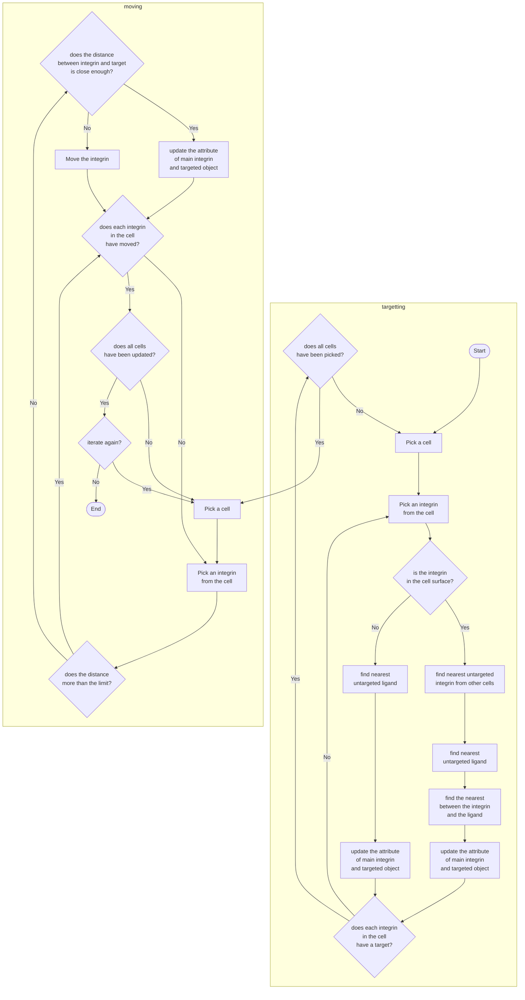
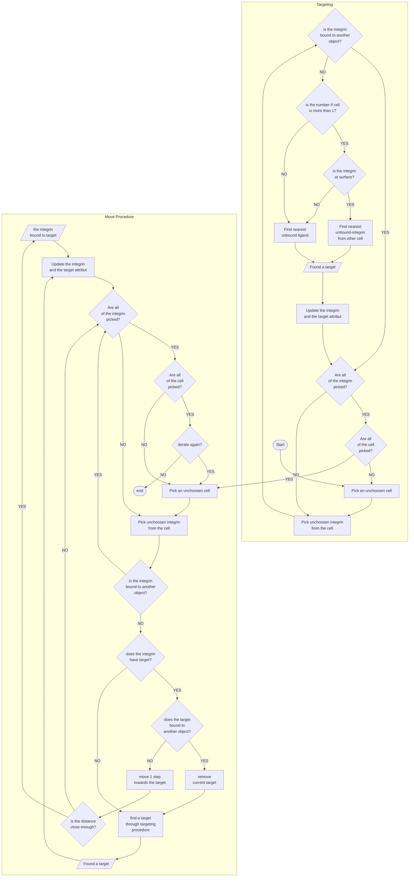

# Simulation Flowchart

This page contains the flowchart of the simulation.

## Procedure Mark-I
this flowchart is named as simulation number 1. This simulation account the surface integrin but have strict rules on targeting procedure. The ligand only can be targeted by single object, same as the integrin-integrin interaction. 

This flowchart occurs after all the elements has been created. The element are nanopattern (contains ligands) and 
cells (contain integrins)

These flowchart ia a simple mechanisme and has not include any law of physics

## Procedure Mark-II

This procedure is named by simulation2. The differences is this procedure allow multi-targeting to occur, in which a ligand can be targeted by many-objects. Another upgrade that is introduced in this procedure are as follows:
  1. The distance of targeting will be made short.
  2. Surface integrin prioritize integrin-integrin interaction, as long as below the limit distance, surface integrin doesn't search any nearest ligand afterwards.
  3. The integrin does validating routine which checks the target position (if the target is integrin) and also bound status of the target. If the target has bound to another object, the integrin will do the searching routine to find another nearest target. 
  4. The limit of surface can be set through celcon.txt
  5. Integrin who have not found any nearest object, will do random move. 

