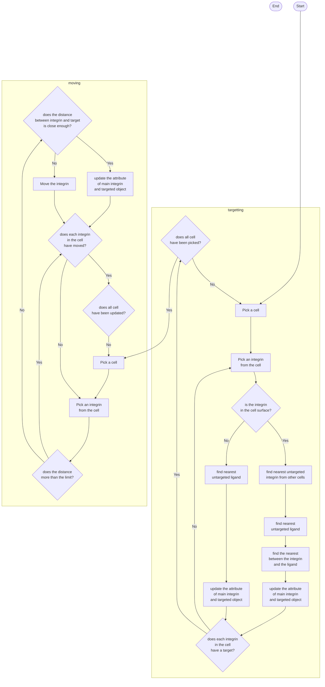

# Simulation Flowchart

This page contains the flowchart of the simulation. Because the main program has not had any simulation procedure, 
this flowchart will be the planned procedure for the future.

This flowchart occurs after all the elements has created. The element are nanopattern (contains ligands) and 
cells (contain integrins)

